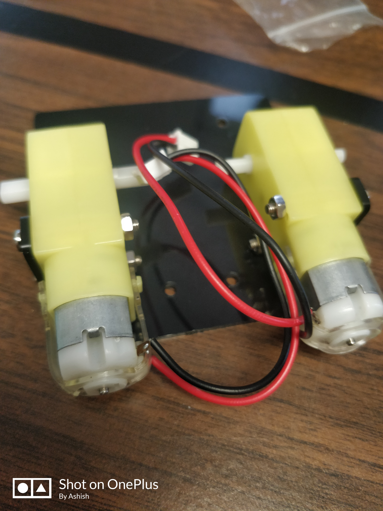
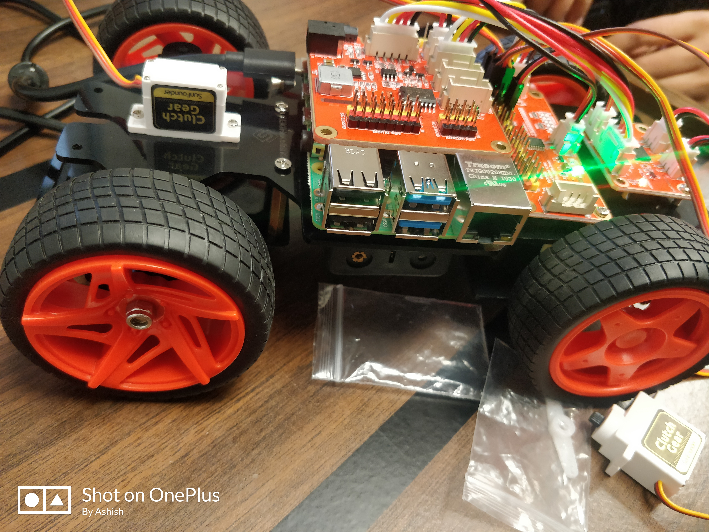
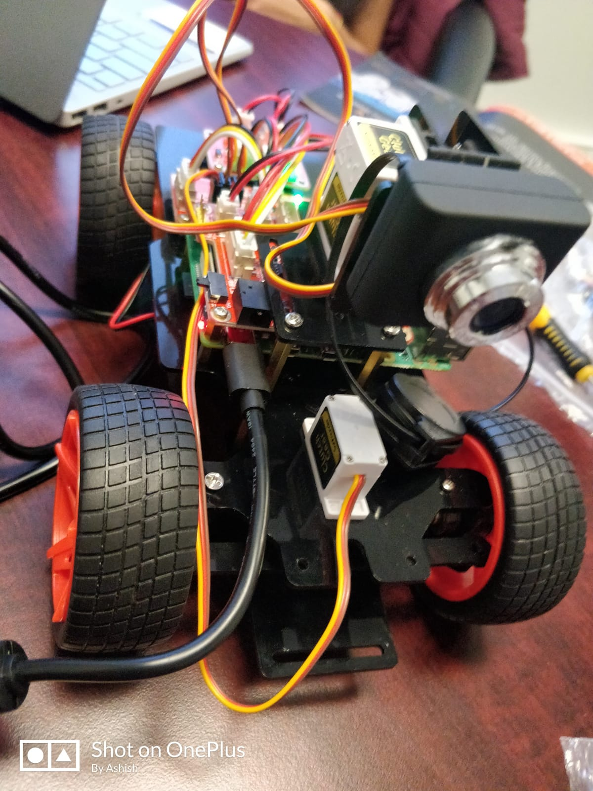
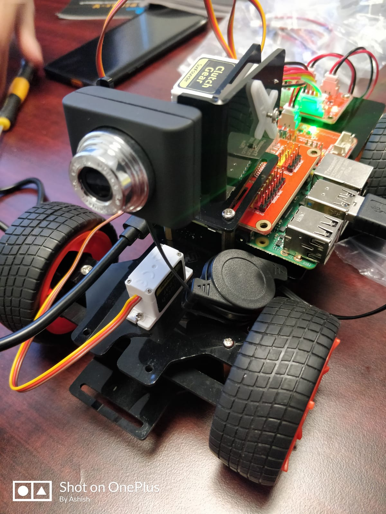
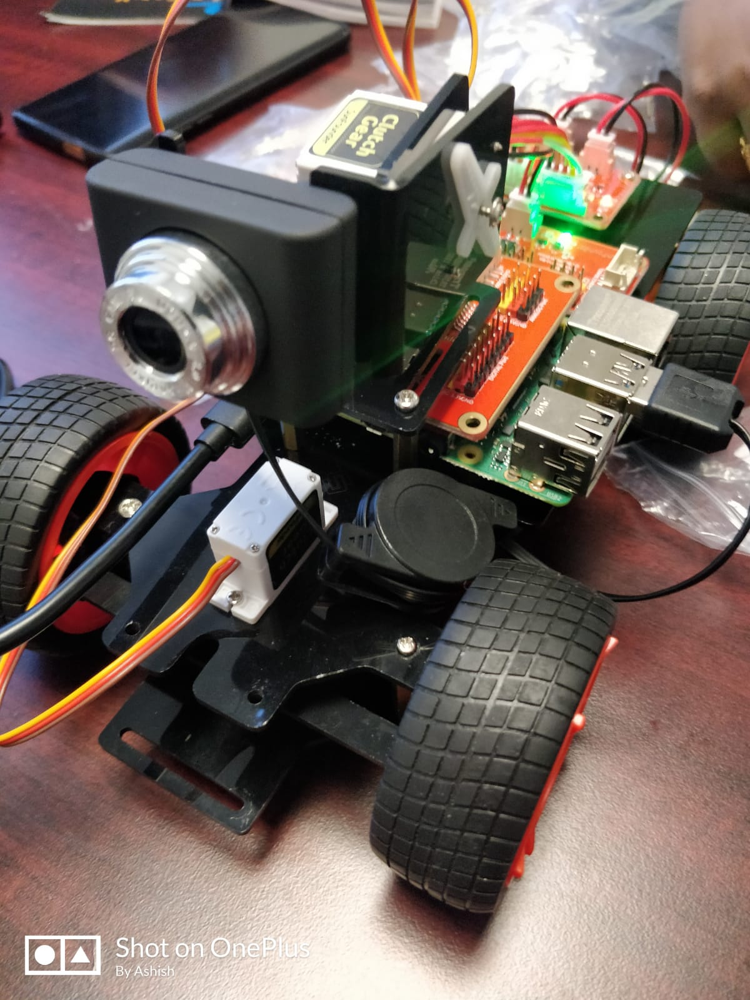

### Autonomous Car using Machine Learning and Deep Learning
## Autonomous Car project in CPSC552 Data Mining at University of Bridgeport

# Group 4
Ashish Gir 
Suma
Gayathri

# Objectives:

Understanding Data Mining Techniques and Deep Learning
Become familiar with Python, Keras, Tensorflow and OpenCV
Gain experience with research on autonomous vehicle and data mining

The main purpose of this project is to become familiar with data mining techniques, specifically Convolutional Neural Network (CNN), and to apply them to real world problems, i.e., autonomous vehicle.

# Phase 1: Assembly an Autonomous Vehicle

As an autonomous vehicle for this project, we are going to use "Smart Video Car Kit V2.0 for Raspberry Pi" as below:

Model: Sunfounder Smart Video Car Kit V2.0 for Raspberry Pi  
Name in this project: DM-Car  
URL: https://www.sunfounder.com/smart-video-car-kit-v2-0.html

    
     
 
    
      
    
 

