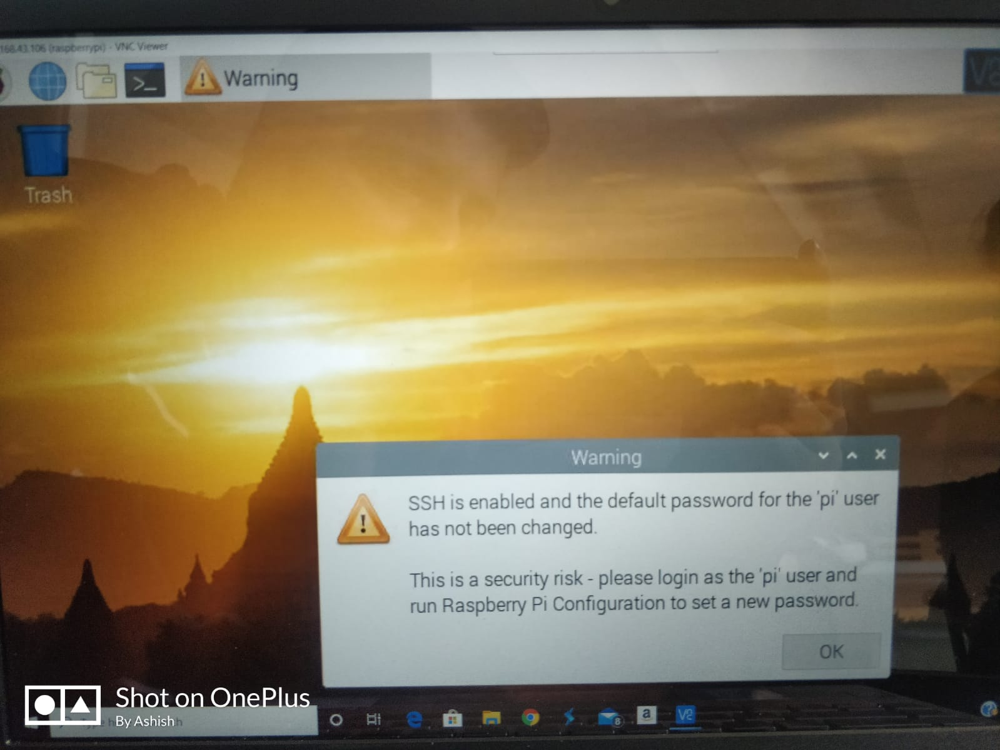
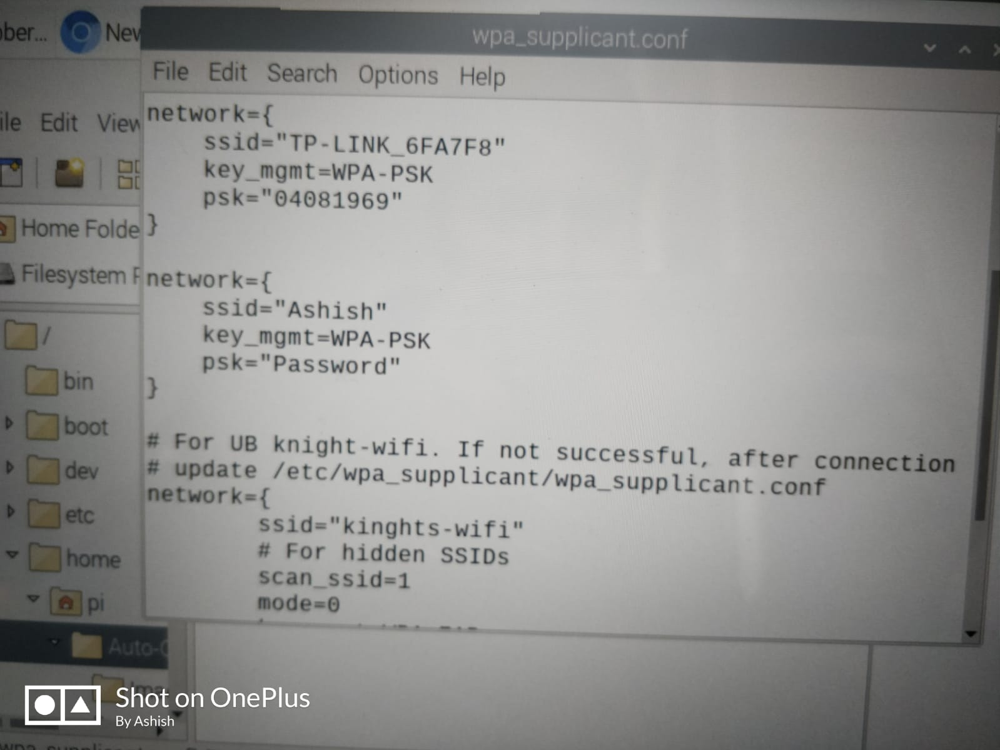

### Autonomous Car using Machine Learning and Deep Learning
## Autonomous Car project in CPSC552 Data Mining at University of Bridgeport

# Group 4
Ashish Gir 
Suma
Gayathri

# Objectives:

Understanding Data Mining Techniques and Deep Learning
Become familiar with Python, Keras, Tensorflow and OpenCV
Gain experience with research on autonomous vehicle and data mining

The main purpose of this project is to become familiar with data mining techniques, specifically Convolutional Neural Network (CNN), and to apply them to real world problems, i.e., autonomous vehicle.

# Phase 1: Assembly an Autonomous Vehicle

As an autonomous vehicle for this project, we are going to use "Smart Video Car Kit V2.0 for Raspberry Pi" as below:

Model: Sunfounder Smart Video Car Kit V2.0 for Raspberry Pi  
Name in this project: DM-Car  
URL: https://www.sunfounder.com/smart-video-car-kit-v2-0.html

    
     
 
    
      
    
 

# This project has the following requirements:
Understanding Data Mining Techniques and Deep Learning
Become familiar with Python, Keras, Tensorflow and OpenCV
Gain experience with research on autonomous vehicle and data mining
To do this we built a raspberry pi powered car with a trained deep learning model to recognise and respond to up to 6 traffic signs. In addition, the car should also be capable of lane detection and not stray outside of the lanes.

# Q: Car Improvement suggestions:
Better supplied instructions. Diagrams are poor quality and mistakes were evident in the text.
Not putting hdmi port behind servo
Would prefer more sturdy materials or at least replacement plastic boards.
Different wheels for better traction on different surfaces.
There should be a protective shell on the car to protect sensitive boards.
Battery placement on the bottom and held in with a ribbon does not seem the best idea. Perhaps a case with a firm fastened lid.
Some sort of battery sensor would be nice to know when the batteries are low.

# Phase 2: Download Programs and Configuration
In this project, we are going to use Raspberry Pi 3 model B+ to control servos using Python.
The car has the following functionalities:

1. Straight lane detection
2. Controlling back wheel servos
3. Controlling front wheel servos
4. Camera module
5. PID Control
6. Creating Video Clip

  

# Q: Improvement suggestions for connectitvity:
A: A wifi direct option would be preferrable as latency in the router is not great.
Can possibly be achieved by using dnsmasq and may help improve image reliability for person using the car.

# DM-Car has 3 PCB as below: 
• Robot HATS: Connecting Raspberry Pi into controllers 
• PCA 9685 PWM Driver: controlling 1 servos for front steering wheel and 2 servos for pan and tilt of a camera 
• TB6612 Motor Driver: controlling 2 servos for back wheels 

